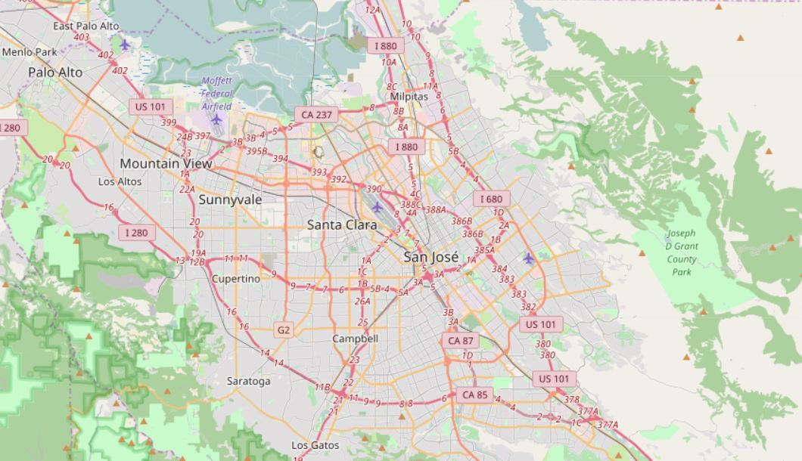
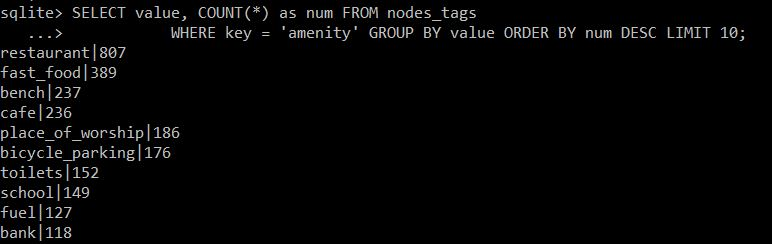

## OpenStreetMap Data Exploration
Language: Python (pandas, re, sqlite3), SQL  
Skills: Data Wranggling, Data Cleaning, SQL(Database Creating and Data Analysis)  
After the data has been audited, standardized, and converted from XML to CSV format, it was used to create a SQL database for data analysis. 
 

  

 

  

 
